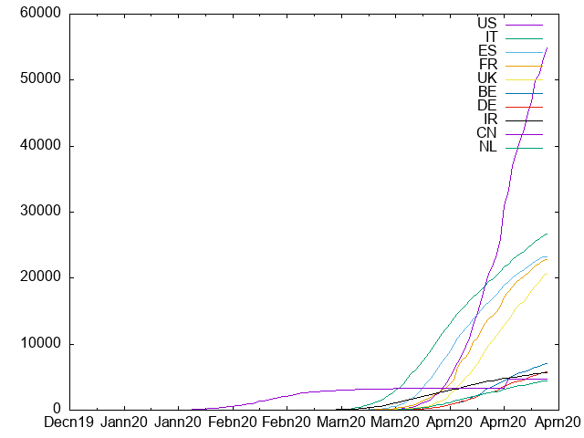

# COVID-19 SQLite Challenges
Manipulations over the WHO's Covid-19 Database and a script for visualising the total number of deaths in each country since the pandemic started

The challenges include:
1. Determining the relational model
    - raw database scheme
    - functional dependencies
    - candidate keys identification
    - primary key choice
    
2. Normalisation
    - partial dependencies and second normal form convertion
    - transitive dependencies and third normal form convertion
    - Boyce-Codd Normal Form
  
3. Modelling 
    - converting CSV into an SQLite Table
    - SQLite query for the normalisation of the raw data
    
4. Quering
    - The worldwide total number of cases and deaths (with total cases and total deaths as columns)
    - The number of cases and the date, by increasing date order, for the United Kingdom (with date and number of cases as columns)
    - The number of cases, deaths and the date, by increasing date order, for each continent (with continent, date, number of cases and number of deaths as columns)
    - The number of cases and deaths as a percentage of the population, for each country (with country, % cases of population, % deaths of population as columns)
    - A descending list of the the top 10 countries, by percentage deaths out of the cases in that country (with country name and % deaths of country cases as columns)
    -The date against a cumulative running total of the number of deaths by day and cases by day for the United Kingdom (with date, cumulative UK deaths and cumulative UK cases as columns)
5. Visualisation
    - A script that uses GnuPlot which will produce a graph named graph.png with the date on the horizontal axis and the cumulative number of deaths by country on the vertical axis.
      

 

# Coursework Instructions:

<object data="Instructions.pdf" type="application/pdf" width="700px" height="700px">
    <embed src="Instructions.pdf">
        
This browser does not support PDFs. Please download the PDF to view it: <a href="Instructions.pdf">Download PDF</a>.

    </embed>
</object>
